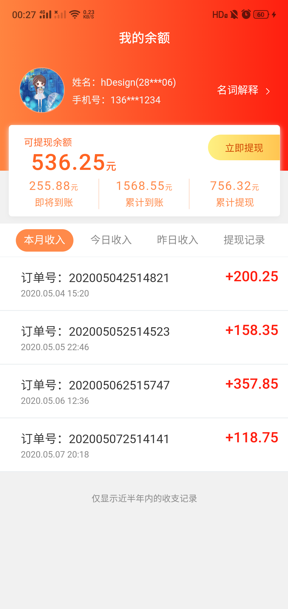
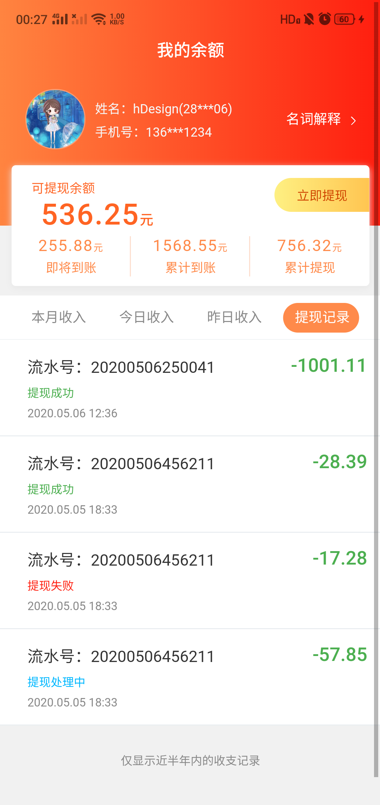
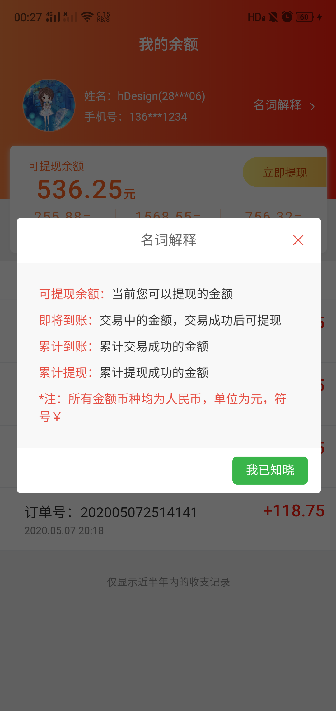
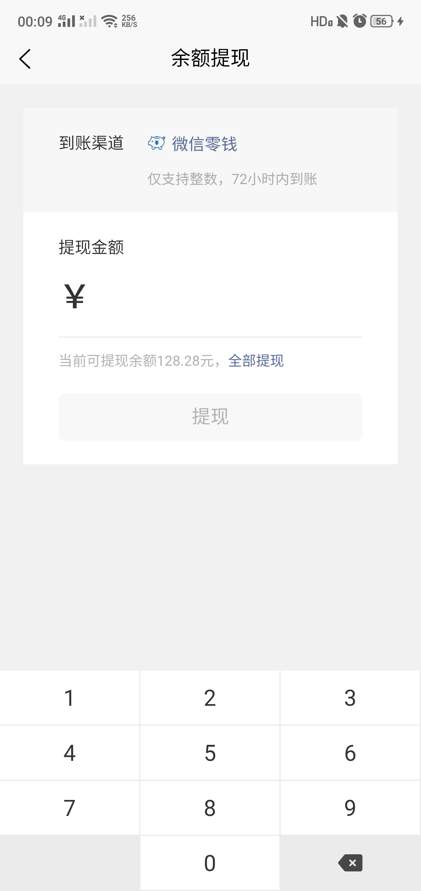
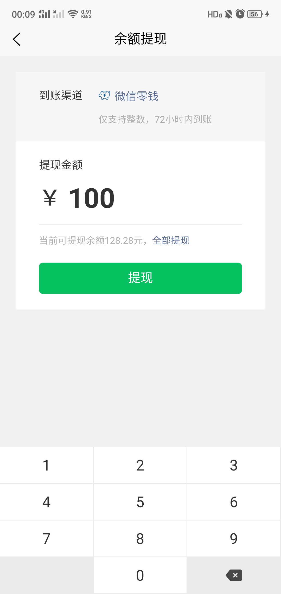
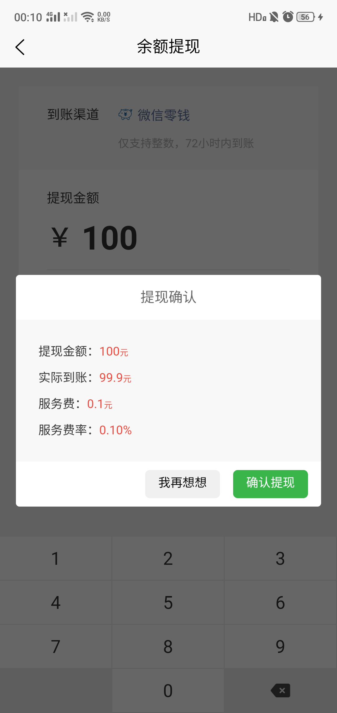
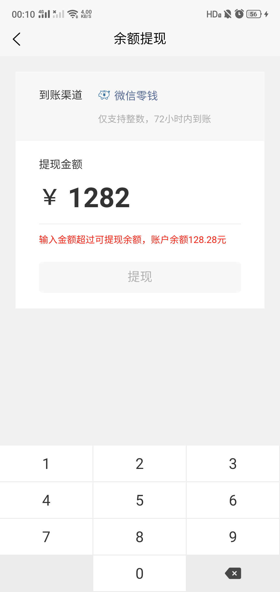

余额管理、提现页面
===============

> 版本 v1.0.0

## 页面特性

* 采用`uniapp`制作，兼容H5、小程序、APP
* 目前仅测试了H5、APP、微信小程序、QQ小程序

## 使用

github使用方法
~~~
https://github.com/lanyanxi/HDesign-Money.git
~~~

uniapp使用方法
~~~
https://ext.dcloud.net.cn/plugin?id=1773
~~~

## 页面演示
<figure class="half">
    
    
</figure>
<figure class="half">
    
    
</figure>
<figure class="half">
    
    
</figure>

<figure class="half">
    
</figure>

## 第三方组件引用说明

* Modal 模态框 使用了 [ColorUI](https://ext.dcloud.net.cn/plugin?id=239)

* tabs 标签 使用了 [ThorUI组件库](https://ext.dcloud.net.cn/plugin?id=556)

## 版权信息

hDesign-Money遵循MIT开源协议发布，并提供免费使用。

本项目包含的第三方源码和二进制文件之版权信息另行标注。

版权所有 Copyright © 2020 [蓝颜夕.](http://www.lanyanxi.com) All rights reserved.

更多细节参阅 [LICENSE](LICENSE)
